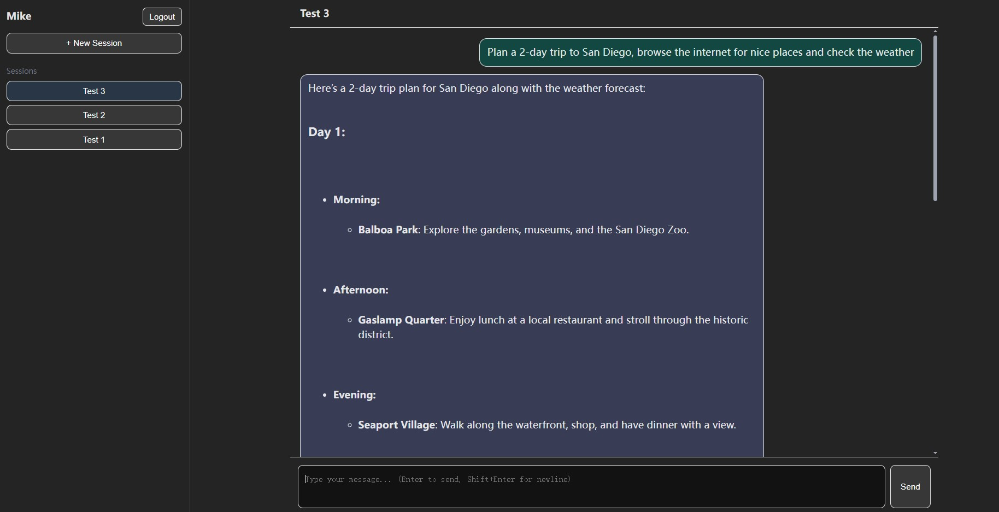

# Design Doc V1.0: AI Trip Planner

## 1. Overview

**Trip Planner** is a lightweight full-stack AI assistant system built using **LangGraph + Flask + Vite + React**.
It provides an intelligent travel planning assistant that supports:

* Multi-user identity isolation
* Multi-session conversation management
* Short-term (state) and long-term (memory) persistence
* Tool-based reasoning (e.g., weather lookup, web search)
* A modern front-end chat interface with markdown rendering



The project is designed for **course and research purposes**, emphasizing modularity, explainability, and ease of deployment rather than enterprise-level scalability.

---

## 2. System Architecture

### High-Level Overview

```
+-----------------------+
|        Frontend       |  React + Vite
|  - User login/register|
|  - Chat UI with AI    |
+----------▲-------------+
           │ REST / SSE
           ▼
+-----------------------+
|        Backend        |  Flask + LangGraph
|  - API endpoints      |
|  - LLM orchestration  |
|  - Tool invocation    |
|  - State management   |
|  - Memory persistence |
+----------▲-------------+
           │
           ▼
+----------------------------+
|   Local Storage            |
|  - users.json              |
|  - /data/user_data/{user}/ |
|      ├── memory.jsonl      |
|      └── sessions/         |
+----------------------------+
```

---

## 3. Backend Design

### 3.1 Components

| Module                            | Responsibility                                                      |
| --------------------------------- | ------------------------------------------------------------------- |
| **`server.py`**                   | Main Flask app; serves REST APIs and static files                   |
| **`trip_planner/orchestrate.py`** | Builds the LangGraph agent graph and orchestrates state transitions |
| **`trip_planner/tools.py`**       | Defines callable tools (e.g., weather lookup, web search)           |
| **`trip_planner/llm.py`**         | Initializes the LLM model (ChatGPT / local model)                   |
| **`trip_planner/memory.py`**      | Implements persistent long-term memory (embedding-based retrieval)  |
| **`trip_planner/user.py`**        | Manages user accounts, tokens, and session metadata                 |

---

### 3.2 Multi-User Storage Layout

Each user has their own isolated data directory for container-level separation:

```
data/
├── users.json                   # token → user mapping
├── user_<hash>/
│   ├── profile.json             # name, description
│   ├── memory_store.jsonl       # long-term memory
│   └── sessions/
│       ├── session_<id>.json    # per-session state (chat history)
│       └── ...
```

---

### 3.3 API Endpoints

| Endpoint                        | Method | Description                                                                 |
| ------------------------------- | ------ | --------------------------------------------------------------------------- |
| `/api/create_user`              | POST   | Register a new user with `name` and `description`, returns `identity_token` |
| `/api/create_session`           | POST   | Start a new chat session, returns `session_id`                              |
| `/api/get_sessions`             | GET    | Retrieve all sessions (sorted by latest), includes username                 |
| `/api/get_conversation_history` | GET    | Fetch entire conversation for a session                                     |
| `/api/chat`                     | POST   | Send one user message, returns assistant’s reply (supports streaming/SSE)   |

Each request is validated using the `identity_token`.
Sessions belonging to the same user **share long-term memory** but have independent state histories.

---

### 3.4 State vs Memory

| Type                   | Description                                                               | Lifespan            |
| ---------------------- | ------------------------------------------------------------------------- | ------------------- |
| **State (short-term)** | Conversation context within a single session (messages, tool calls, etc.) | Until session ends  |
| **Memory (long-term)** | Cross-session user knowledge, embedded via OpenAI Embeddings              | Persistent per user |

During chat:

1. The latest user message is appended to the session state.
2. Memory retrieval runs (`cosine similarity` over embeddings) and injects relevant snippets.
3. LangGraph processes state and tool calls.
4. Agent response is saved back into both the session and memory store.

---

## 4. Frontend Design

### 4.1 Tech Stack

* **React + Vite** — lightweight modern setup
* **React Markdown + remark-gfm** — render markdown responses from AI
* **Fetch API** — simple REST calls
* **Cookies** — store identity token

### 4.2 Key Pages

| Page               | Description                                                                  |
| ------------------ | ---------------------------------------------------------------------------- |
| **Login Page**     | Input or paste `identity_token`; verifies with backend before entering       |
| **Register Page**  | Create a new user (name + intro), receive and display token                  |
| **Main Dashboard** | Sidebar lists sessions and "New Session" button                              |
| **Chat View**      | Markdown-based chat interface with auto-resizing input and loading animation |

### 4.3 UI Behavior

* Input auto-expands for multi-line typing.
* Smooth scroll to bottom on new messages.
* “Typing bubbles” animation shown while waiting for backend.
* Invalid token → error popup and stays on login page.
* Session persistence (using cookies + session ID in URL or state).

---

## 5. Summary

This system demonstrates a full AI-agent pipeline:

* Multi-user architecture
* Integrated LLM reasoning and tool use
* Persistent and retrievable memory
* Modern, reactive frontend
  It is built for clarity, modularity, and educational transparency — a complete, reproducible demo of an **LLM-driven conversational system**.
